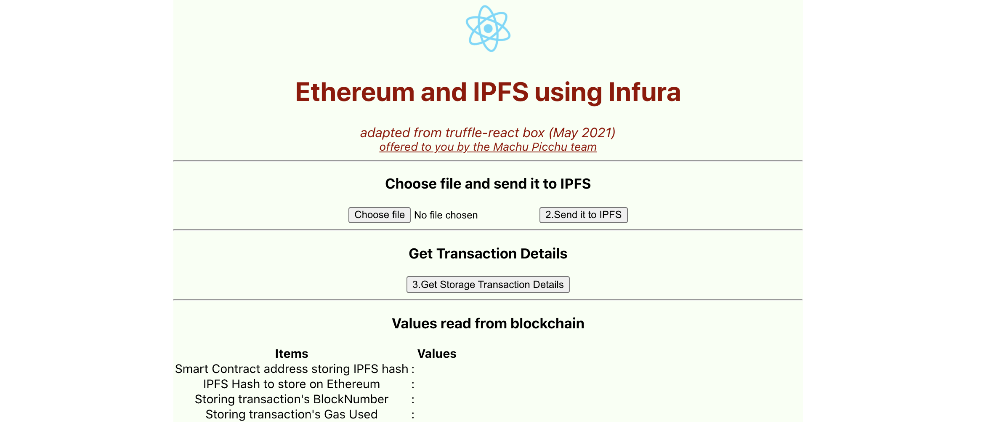

# Full stack blockchain IPFS and React example
In this example we'll store a file in IFPS and its hash on Ropsten, starting from Create React App boilerplate.
[](https://opensource.org/licenses/MIT)
[](https://github.com/Machu-Pichu/general.git)
[](https://github.com/Machu-Pichu/general.git)

## *Warning of March 2023: this article is obsolete*
In 2023, two years after this article was written, the development environment has changed a lot, making this article obsolete. If you are interested in learning full stack development using Ethereum and IPFS, I found the following resources:
1. This article is from Feb 2023 so it should be up to date. Moralis is an automatic dApp generator service. It hides a lot of complexity but you are locked in using Moralis services. It's free for simple tutorial dApp but for real-life project, it is a paid service. https://moralis.io/ipfs-ethereum-tutorial-how-to-use-ipfs-with-ethereum/
2. This one is also from Feb 2022 but it uses Polygon blockchain instead of Ethereum, and the testnet Mumbai of Polygon, so it should be agnostic of the Ethereum switch to PoS. The only drawback is that the tutorial is very ambitious, so the learning curve is steep. If you succeed, you'll know the most from this tutorial. https://dev.to/edge-and-node/the-complete-guide-to-full-stack-web3-development-4g74

If you prefer a tutorial on YouTube, this one may also be helpful. It's not really fully usable for a real-life project because it uses a local blockchain instead of a public testnet, so it accepts only you as user. It uses PINATA for IPFS access, instead of infura. Otherwise, the code seems to work, but I haven't tried it: https://www.youtube.com/watch?v=1dWxCE_RfaE

Hope it helps. If you are curious, I'm in the process of writing a much ambitious suite of articles how to learn Solidity using Remix. These articles are not complete yet, but when done, it will show how to use ERC20 (fungible) tokens, ERC721 (non fungible) tokens with IPFS, and ERC155 (multiple use) tokens.
Here is the starting point: https://github.com/kvutien/Project-Machu_Picchu_White_Paper_Tutorial2023

## *Initial article written in May 2021*


This project is the simplest possible example of a Full Stack dApp using blockchain + IPFS + React. A kind of blockchain IPFS "_Hello World_" but Full Stack. This dApp takes a file of your choice, uploads it on IPFS, stores the IPFS hash of this file in a Ethereum smart contract residing on the testnet Ropsten.

It started from [this tutorial](https://www.freecodecamp.org/news/hands-on-get-started-with-infura-and-ipfs-on-ethereum-b63635142af0/) and modified it to correct some mistakes and compatible with the latest versions of React, Bootstrap, IPFS, Remix and nodeJS packages.

It is part of a series of articles intended to convince you, IT people working for humanitarians, that blockchain programming is not so daunting and can lower your operating costs while bringing a lot of benefits. Join us in project *[Machu Picchu](https://kvutien-yes.medium.com/machu-picchu-how-the-blockchain-can-help-persons-in-need-8396820d13d1)*.

This demo was bootstrapped with [Create React App](https://github.com/facebook/create-react-app). We added progressively packages to make it run. To use it, simply follow the setup instructions below. To reproduce the coding yourself, follow the [coding tutorial](TUTO-1.md) (in progress).

## Setup
The setup instructions use the console utility (`Terminal.app`) from MacOS. The setup instructions are the same if you use Linux Ubuntu. 

Under Windows, it is strongly recommended to run a [VirtualBox](https://www.virtualbox.org/wiki/Downloads) for Windows and install a Ubuntu Virtual Machine inside it. Here is a YouTube video of 4 minutes, that can guide you through this double installation process: https://youtu.be/8mns5yqMfZk.
### Overall environment setup, using MacOS
This setup is an improvement of your configuration and serves many purposes, not only this "_HelloWorld_" demo.
* Install [Brew](https://brew.sh/)
* Install nodeJS via brew: `brew install node@14.17.0`  (this version of nodeJS is the last long term stable support)
* Install a browser that is compatible with Metamask, like Chrome or Firefox. Chrome has better debugging tools.
  * If you use MacOS, Chrome is available from [here](https://support.google.com/chrome/answer/95346?)
  * If you use Ubuntu, download and install as below
``` bash
        $ wget https://dl.google.com/linux/direct/google-chrome-stable_current_amd64.deb
        $ sudo apt install ./google-chrome-stable_current_amd64.deb
```
* Install Metamask extension for your browser and feed one account with some ETH on testnet Ropsten. Select this account.
  * [video guide to install Metamask:](https://youtu.be/WAStJtjYI_c) 
  * [faucet to request test ETH for Ropsten:](https://faucet.metamask.io/)
### Setup this specific dApp, using MacOS
* Clone this repository
``` bash
$ git clone https://github.com/kvutien/ipfs-dapp.git
    Cloning into 'ipfs-dapp'...
    remote: Enumerating objects: 35, done.
    remote: Counting objects: 100% (35/35), done.
    remote: Compressing objects: 100% (31/31), done.
    remote: Total 35 (delta 4), reused 35 (delta 4), pack-reused 0
    Receiving objects: 100% (35/35), 770.87 KiB | 4.21 MiB/s, done.
    Resolving deltas: 100% (4/4), done.
$ cd ipfs-dapp
```
* install the dependencies
``` bash
$ npm install
    ...
    found 566 vulnerabilities (1 low, 565 high)
    run `npm audit fix` to fix them, or `npm audit` for details
$
```
* disregard the warnings. Run the demo by typing
``` bash
$ npm start
```
* your browser will open a new tab and display



* make sure that your browser has a Metamask extension, that Metamask is using the tesnet Ropsten with an account that has some ETH. Else the transaction will be refused and you have to refresh the screen to reload the dApp.
* **hint**: if you leave the default Metamask gas price of 1 gwei, the storage transaction will take some time on Ropsten to be included in a mined block, specially during peak hours because even if Ropsten is a test net, its logic reproduces the logic of the main net and favors transactions with high gas price. Wait for the spinner to stop pulsing before using button 3.
  
## What's next?
This dApp was created using `create-react-dapp`, the generic tool provided by the React team to make a bare-bones React application. From that we manually added the `web3` package to make blockchain transactions and the `ipfs-http-client` package to use IPFS.

To be complete, you have a [tutorial here](./TUTO-1.md) to guide you through the pieces of code and get acquainted to blockchain programming and IPFS. In addition, it will also guide you to put your dApp in production on a public web hosting service like Netlify.

It is becoming easy to be a production Full Stack blockchain programmer. Stay tuned.
