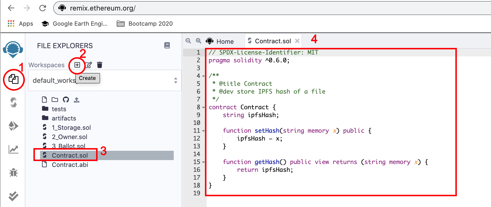
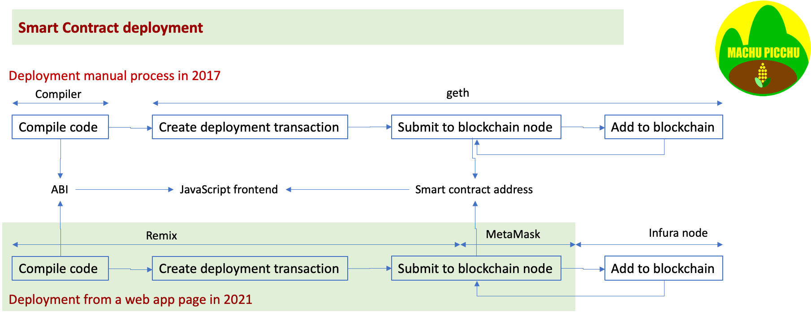

# Tutorial Full Stack "_hello World_" IPFS + blockchain - Part 1: smart contract
## Why this tutorial?
The github of IPFS in JavaScript is quite daunting for a beginner: https://github.com/ipfs/js-ipfs.git. The same holds for the Ethereum and Infura explanations in their respective docs. A benediction for the geeks, but quite a steep move for the newcomers.

This tutorial is a kind of "_Hello World_" that covers a Full Stack blockchain and IPFS workflow, including deployment in production. After you have completed it, you'd have deployed a blockchain smart contract on a public testnet, stored a file on IPFS using a web app that is publicly hosted. It is more ambitious than the usual tutorials that end up with a demo that only stays on your local computer.

If you are relatively new to blockchain, the jargon is explained [here](./TUTO-5.md).

### This tutorial is for you …
* if you are a top-level manager, not impressed at all by the hype about blockchain and IPFS, and looking for a VERY simple hands-on coding to prove it
* if you want to see a Full Stack exercise, including deployment in production and not only a local demo
* if you know a minimum about MetaMask, the most popular blockchain gateway (https://kvutien-yes.medium.com/metamask-for-beginners-d45029e01735)

Otherwise, you may prefer to just read through this article even if you don't intend to do any hands-on exercise because it will also explain the reasons of each step, the "why" and not only the "how".

This hands-on requires that you have a computer with a Unix-like operating system like MacOS or Ubuntu. If you have Windows, you may want to install VirtualBox for Windows, plus the Extension Pack (https://www.virtualbox.org/wiki/Downloads) and then install Ubuntu inside a virtual machine. This is not difficult. Here is a YouTube video of 4 minutes, that can guide you through this double process: https://youtu.be/8mns5yqMfZk.

**Hint**: When you execute actions guided by this tutorial, if you need any help on an error message, copy-paste the message on a search engine followed by `stack exchange`. Many other people have met the same issue before you and most answers have been already given on the Internet.

## Contents of the tutorial dApp
In this tutorial, you'll select a file, publish it on IPFS, retrieve the hash of this file and store it on the blockchain. You can think of a hash of a file on IPFS as the URL to retrieve it.


## What are the programming steps?
The most direct steps to obtain a dApp deployed in production are:
* (Preamble) Install MetaMask on your favorite browser (attention: Safari doesn't support MetaMask);
* Use Remix to compile and deploy on a public testnet the smart contract that stores the IPFS hash in the blockchain;
* Create a React frontend:
  * generate a scaffold with `create-react-app`,
  * import the necessary library code modules,
  * write (or copy-paste) the glue code and try it locally from your browser with your MetaMask extension,
  * generate the build standalone of the frontend;
* Drag-and-drop this build on a free hosting web service (in our case we use Netlify).

This part 1 ends after we've deployed the smart contracts on Ropsten.

[Part 2](./TUTO-2.md) and [Part 3](./TUTO-3.md) guide you to have a frontend executing locally.

[Part 4](./TUTO-4.md) covers the public deployment on a hosting service, using the free tier of this commercial service.


## Install MetaMask extension
If you have never installed nor used MetaMask from your browser, read the explanations here (https://kvutien-yes.medium.com/metamask-for-beginners-d45029e01735) and follow the YouTube installation video guide here https://youtu.be/WAStJtjYI_c.

## Use Remix for the smart contract
Remix is a browser-based Solidity blockchain development environment made by the Ethereum Foundation. It has a different purpose than Truffle, that is a full local JavaScript + Solidity dApp development environment made by ConsenSys. To deploy a simple smart contract on the blockchain, it is simpler to use Remix. To develop a more complex dApp, it is more productive to use Truffle because it supports both frontend and backend development and has a built-in automated test execution environment.
### Code the smart contract
To start using Remix, open from our browser at the address http://remix.ethereum.org/. Click on the "File Explorers" icon (1), create a new file (2), name it `Contract.sol` and copy-paste the following smart contract code in the text editor window.
```javascript
// SPDX-License-Identifier: MIT
pragma solidity ^0.6.0;

/** 
 * @title Contract
 * @dev store IPFS hash of a file
 */
contract Contract {
    string ipfsHash;
    
    function setHash(string memory x) public {
        ipfsHash = x;
    }
    
    function getHash() public view returns (string memory x) {
        return ipfsHash;
    }
}
```


The `pragma` statement specifies which compiler version to use.

The function `setHash` receives a string `x` as argument and stores it in its variable `ipfsHash`, making it part of the blockchain. The function `getHash` returns the string value stored in the variable `ipfsHash`. This is as simple as a smart contract can be. It is still powerful because once the value of `x` is stored in `ipfsHash`, it will remain in the blockchain for as long as the smart contract `Contract` exists in the blockchain, which means forever.
### Compile the smart contract
To compile the smart contract, click on the icon "Solidity compiler" (1), select in the drop-down menu a compiler version compatible with the one in the pragma statement of the code (2) and click on button "Compile" (3). If the compilation is successful, the icon "Solidity compiler" will have a green check and the name of the compiled contracts will be displayed in a field (see arrows). Here we have only one smart contract (named `Contract`).


### Copy the ABI of the smart contract
The ABI (Application Binary Interface), is the information with which you call functions in a smart contract from a frontend and get data back. Once the smart contract is compiled, scroll down the left column of Remix and click on the icon "Copy ABI to clipboard". Save it somewhere in a text file, we'll need to copy it back later in the JavaScript of the frontend. 


In this example, the ABI would be:
```javascript
[
    {
        "inputs": [],
        "name": "getHash",
        "outputs": [
            {
                "internalType": "string",
                "name": "x",
                "type": "string"
            }
        ],
        "stateMutability": "view",
        "type": "function"
    },
    {
        "inputs": [
            {
                "internalType": "string",
                "name": "x",
                "type": "string"
            }
        ],
        "name": "setHash",
        "outputs": [],
        "stateMutability": "nonpayable",
        "type": "function"
    }
]
```
### Deploy the smart contract on testnet blockchain Ropsten
Now the blockchain magic starts. We'll deploy this smart contract on the blockchain testnet named Ropsten, using 2 services provided by ConsenSys: MetaMask and Infura. Not so long ago, in 2017, you'd need to run a complete blockchain peer node to do this manually.

There are several mouse clicks to do. It's a full blockchain production deployment, after all.

1. click on the icon "Deploy & run transactions" (1);
2. click on the MetaMask extension icon, that will open MetaMask popup (2);
3. in the popup, verify that we have selected the testnet Ropsten (3);
4. verify that the account we have selected has indeed some ETH to fund the deployment, if not use the icon (4) to select another account that has some;
5. verify that the Remix web page has succeeded being connected to MetaMask to use its service (5);
6. in the drop-down menu, select the environment "Injected Web3" (6);
7. verify that indeed Remix has recognized the Ropsten network and show network ident 3 (7);
8. verify that Remix is using the right account number to execute the deployment (8);
9. verify that the contract that will be deployed is the one we want, here `Contract`. Click on the button "Deploy" (9).


MetaMask will display a pop-up asking us to confirm that we accept to pay for the transaction that will deploy the smart contract. Click "Confirm".


After a few seconds, the time it takes for the transaction to be included in a block and recorded on blockchain, Remix will display the address where the contract is deployed on blockchain Ropsten and available for execution. Click on the link to `etherscan.io` (arrow) to see how the deployment is witnessed by the community.


Click on the icon "Copy value to clipboard" and save it in a text file for later use in the frontend. In our case, the deployed smart contract is at: `0x01A619843Dd6Ea06c863d8033312eaF36669DB90`. We'll see it later in the file `storehash.js`

## What have we learned?
This concludes part 1 of the tutorial. 
1. You have deployed in production a smart contract on the blockchain, using Infura.
2. You have copied the ABI (Application Binary Interface) of your smart contract for use in the JavaScript frontend.
3. You have copied the public address of your smart contract on the blockchain for use in the JavaScript frontend.

The next steps are to program the frontend and also deploy it in production.

## Summary of the blockchain production deployment magic
We did the following with a few clicks on a browser page with an extension.
1.	We used Remix on a browser to write a smart contract, compile it and submit it for deployment.
2.	We used MetaMask browser extension to choose an account to pay the deployment transaction. It built the JSON-RPC call to a blockchain node.
3.	Invisible to us, Infura runs a blockchain testnet node. The Infura node accepted our the transaction and inserted it in the blockchain, waited for the peers to accept. When done, it sent back to our browser the smart contract address and other properties of the successful deployment transaction.

Not so long ago, in 2017, we'd have to run ourselves a blockchain node using a node software named `geth`, to call one by one the `geth` functions to manage ourselves the deployment transaction from a paying account, to submit the byte code, to create the bytecode itself and the ABI by running a Solidity compiler. Today we did this with a few clicks on a browser page with a MetaMask extension.


> Blockchain programming and deployment are now within reach of a casual programmer.
