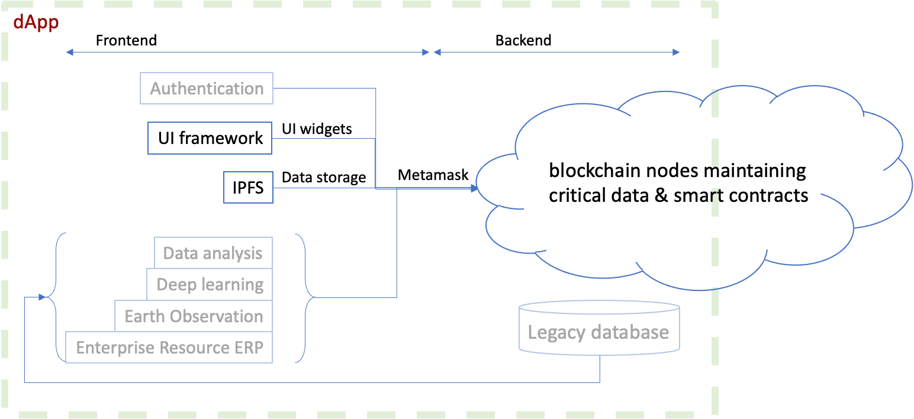
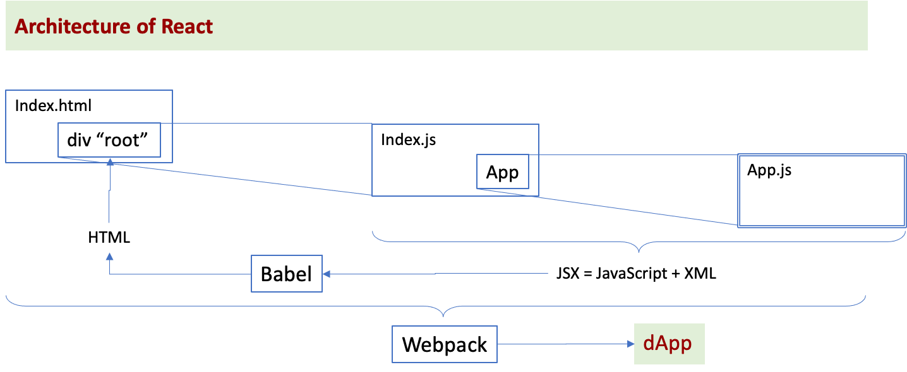
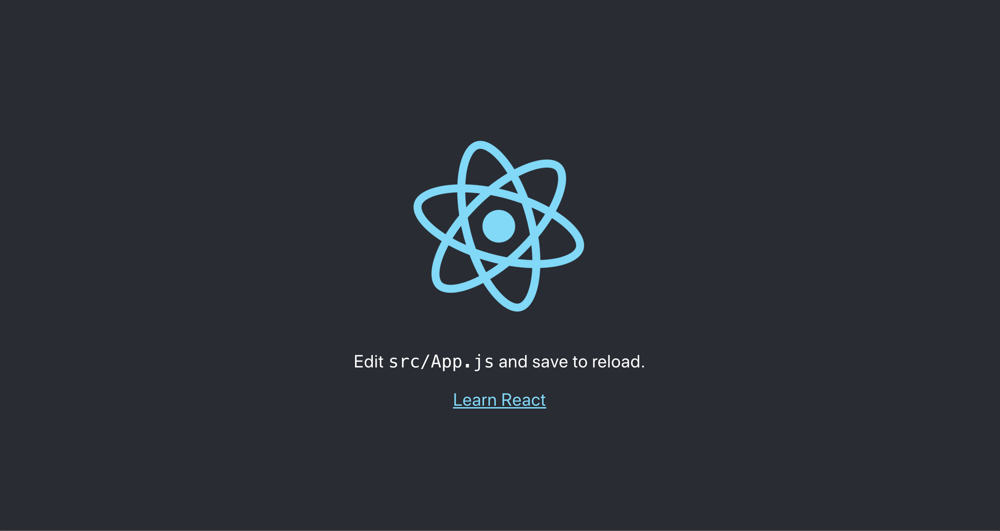

# Tutorial Full Stack "_hello World_" IPFS + blockchain - Part 2: scaffold a React web app
## Why this tutorial?
This 4-part tutorial is a kind of "_Hello World_" that covers a Full Stack blockchain and IPFS workflow, including deployment in production. After you have completed it, you'd have deployed a blockchain smart contract on a public testnet, stored a file on IPFS using a web app that is publicly hosted. It is more ambitious than the usual tutorials that end up with a demo that only stays on your local computer. Here we go one step further, in production.

1. In [Part 1](./TUTO-1.md) we've coded our smart contract and deployed it in production on the Ropsten test net.
2. In this part we'll use the existing libraries and tools to scaffold a boilerplate React webapp and have it executing.
3. In [Part 3](./TUTO-3.md) we'll add our actual code and run it locally.
4. In [Part 4](./TUTO-4.md) we'll deploy the frontend in production.

If you are relatively new to blockchain, the jargon is explained [here](./TUTO-5.md).

**Hint**: When you execute actions guided by this tutorial, if you need help on an error message, copy-paste the message on a search engine followed by `stack exchange`. Many other people have met the same issue before you and many answers have been given on the Internet.

> _This tutorial will contain explanations that are not directly related to the coding task. These explanations will be highlighted as "Insider Notes". You can skip reading them without damage to the coding._

## Architecture of a dApp
A dApp is a "distributed application" involving a blockchain. A frontend is what makes the bulk of a dApp. The critical data and logic of a dApp are stored on the blockchain –-the backend-– while the data and logic that are not critical make the frontend.

To code the frontend we'll use mostly a text console, or a `shell`. On MacOS and Ubuntu, it is named `Terminal`. The actual software is either `bash` or `zsh`. You'll get quickly used to it.

The following diagram shows a blockchain dApp architecture, in general. The greyed functional blocks depend on the kind of application and are not part of our "_Hello World_" demo.


## _Insider Note_: Quick presentation of React
_You can skip this section if you are only interested in doing the coding._

React is a tool that reads a mixture of JavaScript and XML code ("JSX") to generate HTML code using a "transpiler" named `Babel`. React injects this HTML inside a `div` component of the main `index.html` that is rendered by a browser. This component `div` is always called "root".

A React user application resides mainly inside a component named `App.js` and in its related `App.css` style sheet. To build a standalone application that a web host can serve inside `index.html`, React uses the open source `webpack` tool that bundles all JavaScript modules. Besides that, React imposes no special coding style nor paradigm.

We can summarize React as follows:


The typical React development workflow is
1. scaffold from the console with `create-react-app`
2. check execution with `npm start` from the console: React will open a web page served from `localhost:3000`
3. edit `App.js` and other files eventually that make your application
4. each time you save `App.js`, the `webpack` will automatically compile and run your code, refresh the web page.

Thus, you'll immediately see the bugs that you introduced in your code. Save frequently to check the correctness of your code.

## _Insider Note_: Quick presentation of `npm`
_You can skip this section if you are only interested in doing the coding._

You have noticed that this "_Hello World_" coding exercise achieves a lot with relatively little effort. 

It relies on the abundance of coding resources provided by `npm` (`node` Package Manager). It does a single job and does it well. When you code in JavaScript, you'll see it everywhere: package manager, version manager, dependencies manager. If you are curious to know more about, see this article from FreeCodeCamp: https://www.freecodecamp.org/news/what-is-npm-a-node-package-manager-tutorial-for-beginners/

## Stepwise approach to code our frontend
In this tutorial we use the latest recommendation from the React team (as of May 2021) to construct a React web app. For this we create first a scaffold web app (a boilerplate) by executing a `nodeJS` module named `create-react-app`. Then we import the other required `nodeJS` modules. Finally, we modify the `App.js` and `App.css` that were scaffolded by  `create-react-app`.

Once the frontend web app is constructed and working locally, we "build" the app (pack it into a standalone folder) and upload it to a public hosting service to deploy in production. In [Part 4](./TUTO-4.md) of this tutorial we use Netlify hosting service.

In our console, we type the following steps to create our React web app:
```shell
$ npx create-react-app ipfs-dapp:       generate scaffold
$ cd ipfs-dapp:                         move inside the working folder
$ npm install react-bootstrap bootstrap: add CSS framework and its React helper
$ npm install react-spinners:           add the waiting spinner during a transaction
$ npm install fs-extra:                 add access to local file system
$ npm install ipfs-http-client web3:    add IPFS access and blockchain access
```
## _Insider note_: MetaMask or not MetaMask?
_You can skip this section if you are only interested in doing the coding._
* We could make this demo without MetaMask if we use the module `@truffle/hdwallet-provider` to submit a transaction. We need to use it inside `truffle`.
* The latest `@truffle/hdwallet-provider` that is compatible with the latest `truffle5` is version 1.2.1.
* The latest `nodeJS` that is compatible with `truffle5` is version 12.18.4.

This is one difficulty when doing coding with open-source tools: version compatibility. To make it simple in this demo, we use the latest MetaMask and skip using `truffle` and `hdwallet-provider`. We will also use the latest LTS (long term supported) `nodeJS`, to reproduce what the user will have when installing `nodeJS` for the first time today.

## Install the boilerplate of a React web app
Let's use the  tool `create-react-dapp` to create a folder that we'll name `ipfs-dapp`. Inside this folder are already all the JavaScript packages and code to make a minimum React application. For this doing, type the following command 
```shell
npx create-react-app ipfs-dapp
```
You'll see the answer showing that a folder `ipfs-dapp` is created, including a `git` version control database:
```shell
$ npx create-react-app ipfs-dapp
    Need to install the following packages:
    create-react-app
    Ok to proceed? (y) y
    Creating a new React app in /Users/kvutien/development/ipfs-dapp.
    Installing packages. This might take a couple of minutes.
    ...
    Initialized a git repository.
    Installing template dependencies using yarnpkg...
    ... 
    Created git commit.
    Success! Created ipfs-dapp at /Users/kvutien/development/ipfs-dapp
    Inside that directory, you can run several commands:
    ...

    Happy hacking!
```

## _Insider note_: what does the scaffold contain?
_You can skip this section if you are only interested in doing the coding._

Let's see what our project folder contains
```shell
$ tree
    .
    ├── README.md
    ├── node_modules
    (1249 packages)
    ├── package.json
    ├── public
    │   ├── favicon.ico
    │   ├── index.html
    │   ├── logo192.png
    │   ├── logo512.png
    │   ├── manifest.json
    │   └── robots.txt
    ├── src
    │   ├── App.css
    │   ├── App.js
    │   ├── App.test.js
    │   ├── index.css
    │   ├── index.js
    │   ├── logo.svg
    │   ├── reportWebVitals.js
    │   └── setupTests.js
    └── yarn.lock
```

Our project root folder is typical
* `package.json` is read when `create-react-app` installed all dependencies.
* The folder `node_modules` contains all dependency packages.
* The folder `public` is populated automatically by React to regenerate our application every time we save `App.js`. You don't need to touch it.
* The folder `src` is our application. We'll populate it in [Part 3](./TUTO-3.md).

## Execute the boiler plate React frontend
```shell
$ cd ipfs-dapp
$ npm start
```
Your browser will open at the address `http://localhost.3000` and display the following:


Congratulations. Your first React application.

## Install dependencies
Now we have to install the dependencies of our own frontend: `react-bootstrap`, `bootstrap`,`fs-extra`, `ipfs-http-client`, `web3`, and `react-spinners`.
```shell
$ npm install react-bootstrap bootstrap
    ...
    added 23 packages, removed 4 packages, changed 7 packages, and audited 1720 packages in 14s
    82 moderate severity vulnerabilities
$ npm install fs-extra
    removed 19 packages, and audited 1701 packages in 5s
$ npm install ipfs-http-client web3
    ...
    added 267 packages, changed 1 package, and audited 1968 packages in 24s
$ npm install react-spinners
    added 18 packages, and audited 1986 packages in 8s
```
## What have we learned?
This concludes part 2 of the tutorial. 
1. You have bootstrapped a boiler plate React application, including automated test tools, that we won't use.
2. You have executed it.
3. You have prepared the actual coding by installing dependencies.

Now come the true changes to the frontend. see [Part 3](./TUTO-3.md), and deploy it in production, see [Part 4](./TUTO-4.md).
