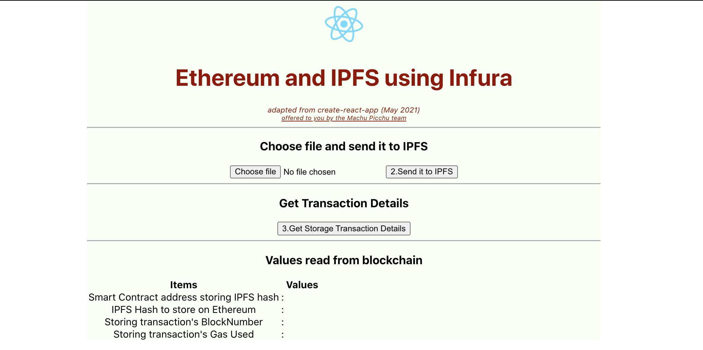

# Tutorial Full Stack "_hello World_" - Part 3
## Why this tutorial?
This tutorial is a kind of "_Hello World_" that covers a Full Stack blockchain and IPFS workflow, including deployment in production. After you have completed it, you'd have deployed a blockchain smart contract on a public testnet, stored a file on IPFS using a web app that is publicly hosted. It is more ambitious than the usual tutorials that end up with a demo that only stays on your local computer. Here we go one step further, in production.

1. In [Part 1](./TUTO-1.md) we've coded our smart contract and deployed it in production on the Ropsten test net.
2. In [Part 2](./TUTO-2.md) we'll use the existing libraries and tools to scaffold a boilerplate React webapp and have it executing.
3. In this part we'll add our actual code and run it locally.
4. In Part 4 we'll deploy the frontend in production.

**Hint**: When you execute actions guided by this tutorial, if you need help on an error message, copy-paste the message on a search engine followed by `stack exchange`. Many other people have met the same issue before you and many answers have been given.

> _This tutorial will contain explanations that are not directly related to the coding task. These explanations will be highlighted as "Insider Notes". You can skip reading them without damage to the coding._

## Code the application
In each file listed below, copy-paste the following code. Better still, copy-paste the latest version of each file from the github repository https://github.com/kvutien/ipfs-dapp.git
## File 1 — `src/ipfs.js`
This is a new file. It exports a JavaScript object with the API description to do IPFS transactions.
```javascript
const IPFS = require('ipfs-http-client');
const ipfs = IPFS.create({
    host: 'ipfs.infura.io',
    port: 5001,
    protocol: 'https' 
});
export default ipfs;
```
## File 2 — `src/getWeb3.js`
This is a new file. It contains a component that returns the "provider" which is a JavaScript object containing the API calls to do blockchain transactions via JSON-RPC calls with a blockchain node. Its logic covers the cases where the dApp is called from the new version of MetaMask, from an old version of MetaMask and where the dApp runs without MetaMask on a local test blockchain network.
```javascript
import Web3 from "web3";
export default getWeb3;

async function fromBrowser() {
    // checks which version of MetaMask is used and set the returned JSON accordingly
    let web3;
    if(window.ethereum) {
        // Browser has new Metamask extension, we have to ask user permission
        web3 = new Web3(window.ethereum);
        // ask user permission for Metamask to connect to an account
        try {
            await window.ethereum.enable();
            // account is exposed
            return web3;
        } catch (error){
            console.log('user refused connection', error);
        }
    }
    else if (window.web3) {
        // Browser has old Metamask extension. Account always exposed
        web3 = window.web3;
        return web3;
    }
    else {
        // Browser has no Metamask extension... try local blockchain
        const provider = new Web3.providers.HttpProvider("http://127.0.0.1:8545");
        web3 = new Web3(provider);
        return web3;
    }
}

async function getWeb3(){
    try {
        const web3 = await fromBrowser();
        return web3;
    } catch (error) {
        console.log('Check that Metamask connected this page to a blockchain account', error);
    }
}

getWeb3();
```
## File 3 — `src/storehash.js`
This new file contains a function that creates the JavaScript instance discussing with the smart contract. 

Code sections to change: In the definition of the `const address = '...'`, copy-paste the address of the contract that Remix deployed on Ropsten. In the definition of the array `const abi = [...]`, copy-paste the ABI as compiled by Remix. We have copied and saved these information in [Part 1](./TUTO-1.md).
```javascript
import getWeb3 from "./getWeb3";
// export an instance of the smart contract that stores IPFS hash

async function storehash() { 
    // Your contract address as deployed by Remix
    const address = '0x40619f0278DE88aB843d8c57A6f6c66e3ab49dd1';   // address deployed in Remix
    // Your contract ABI as copied from Remix
    const abi = [{
        "inputs": [],
        "name": "getHash",
        "outputs": [
            {
                "internalType": "string",
                "name": "x",
                "type": "string"
            }
        ],
        "stateMutability": "view",
        "type": "function"
    },
    {
        "inputs": [
            {
                "internalType": "string",
                "name": "x",
                "type": "string"
            }
        ],
        "name": "setHash",
        "outputs": [],
        "stateMutability": "nonpayable",
        "type": "function"
    }];
    const web3 = await getWeb3();
    return new web3.eth.Contract(abi, address);
}
storehash();

export default storehash;
```
## Edit — `public/index.html`
This modification is purely cosmetic and changes the generic text that is displayed in the browser tab by some text of our own. For example,
```html
    <title>React App</title>
```
is replaced by
```html
    <title>Truffle React IPFS</title>
```
## Edit — `App.css`
This file is the CSS cosmetics of our dApp. There is very little change from the original made by `create-react-app`: the background color and font size and color.
```css
.App {
    text-align: center;
    max-width: 52em;
    min-height: 50vh;
    margin: auto;
    background-color: #f8fff3;
}

.App-header {
    min-height: 20vh;
    display: flex;
    flex-direction: column;
    align-items: center;
    justify-content: center;
    font-size: calc(10px + 2vmin);
    color: white;
}
  
.App-logo {
    height: 10vmin;
    pointer-events: none;
}

@media (prefers-reduced-motion: no-preference) {
  .App-logo {
    animation: App-logo-spin infinite 20s linear;
  }
}

@keyframes App-logo-spin {
  from {
    transform: rotate(0deg);
  }
  to {
    transform: rotate(360deg);
  }
}

.h1 {
    font-size: 1.5em;
    color: #980000;
}

.App-link {
  color: #980000;
  font-size: 0.4em;
}
```
## Insider Notes: JavaScript ES6
_You can skip this section if you are only interested in doing the results of the coding._

React relies enormously on the new language construct of JavaScript ES6. Since not all browsers support yet JavaScript ES6, React uses the transpiler `Babel` to convert the code into a version of JavaScript that is supported by all browsers. You will meet very often the following constructs:
* `import` instead of `require`: this allows the bundler `webpack` to include only specified functions of a module instead of including the whole module. More compact code.
* arrow functions: more compact code and easier to read once you get used to it. Also, arrow functions use a subset of the execution context as compared to normal functions. Example of constructs: `const output = (input) => {do something with input, return output}`
* `async` functions inside which we can do `await` calls to asynchronous functions. When it meets an `await` call, the interpretor doesn't execute the next statement until the called asynchronous function returns. This simplifies asynchronous programming as compared to `promises`.
* in addition to `var` declaration, we have `const` and `let`. This makes more efficient code interpretation.

## Edit — `App.js`
This class is the main application that uses React. Its template was created by `create-react-app`. We change it totally.

Copy-paste the code of App.js below. Better still, copy-paste the latest version from the github repository https://github.com/kvutien/ipfs-dapp.git. We will explain this in a distinct article.
```javascript
import './App.css';
import logo from './logo.svg';

import React, { useState } from 'react';
//import Contract from "./contracts/Contract.json";
import getWeb3 from "./getWeb3";
import ipfs from './ipfs';
import storeHash from './storehash';
import { Button, Table } from 'react-bootstrap';
import { BounceLoader } from 'react-spinners';

function App() {
    const [ipfsHash, setIpfsHash] = useState(null);
    const [buffer, setBuffer] = useState('');
    const [ethAddress, setEthAddress] = useState('');
    const [storeHashTransaction, setStoreHashTransaction] = useState('');
    const [blockNumber, setBlockNumber] = useState('');
    const [gasUsed, setGasUsed] = useState('');
    const [loading, setLoading] = useState(false);
    var file = '';                  // file object with global scope

    /** @dev Take file input from user */
    const captureFile = (event) => {
        event.stopPropagation();    // stop react bubbling up click event
        event.preventDefault();     // stop react refreshing the browser
        file = event.target.files[0];
        let reader = new window.FileReader();
        reader.readAsArrayBuffer(file);
        reader.onloadend = () => convertToBuffer(reader);
    };

    /** @dev Convert the file to buffer to store on IPFS */
    const convertToBuffer = async(reader) => {
        //file is converted to a buffer for upload to IPFS
        const buffer = await Buffer.from(reader.result);
        //set this buffer as state variable, using React hook function
        setBuffer(buffer);
    };

    /** @dev send file to IPFS  */
    const sendIt = async (event) => {
        // set the waiting spinner when starting sendIt
        setLoading(true);
        event.preventDefault();     // stop react refreshing browser at button click
        // store buffer on IPFS
        const ipfsHash = await ipfs.add(buffer);        
        console.log('ipfsHash after ipfs.add:', ipfsHash.path);
        // set the hash (IPFS access key) in state using react hook function
        setIpfsHash(ipfsHash.path);

        try{
            // get the blockchain interface
            const web3 = await getWeb3();
            console.log('web3 sent back by getWeb3: ', web3);
            // bring in user's Metamask account address
            const accounts = await web3.eth.getAccounts();
            console.log('using account in Metamask to pay:', accounts);
            // Get the contract instance, name it storeHashContract
            const storeHashContract = await storeHash();
            console.log('smart contract to store Hash:', storeHashContract);
            //obtain contract address from storeHashContract
            const ethAddress= await storeHashContract.options.address;
            // set the address as a state variable, using react hook function
            setEthAddress(ethAddress);      // 'address' is used in HTML rendering
            console.log('ethAddress storing the IPFS hash:', ethAddress);

            // call smart contract method "setHash" via .send to store IPFS hash in Ethereum contract
            const receipt = await storeHashContract.methods.setHash(ipfsHash.path).send({from: accounts[0]});
            console.log('receipt as returned by smart contract:', receipt);
            setStoreHashTransaction(receipt);
            // reset the waiting spinner when transaction is done
            setLoading(false);
        }catch (error) {
            // catch any errors for any of the above operations.
            alert(
                `Failed to load web3. Check that Metamask connected this page to a blockchain account. Else see browser console for error details.`
            );
            console.error(error);
        }
    };

    const getDetails = async () => {
        console.log('transaction of which to retrieve details:', storeHashTransaction);
        setBlockNumber(storeHashTransaction.blockNumber);   // set state variable, to be rendered in HTML
        setGasUsed(storeHashTransaction.gasUsed);
    }
    
    return (
        <div className="App"  >
            <header className="App-header">
                
                <h1 className="h1" >Ethereum and IPFS using Infura</h1>
                <span  style={{color: '#980000', fontSize: 12}}><i>adapted from create-react-app (May 2021)</i></span>
                <a className="App-link" target="_blank" rel="noopener noreferrer"
                href='https://kvutien-yes.medium.com/machu-picchu-why-should-humanitarian-organizations-be-interested-in-using-blockchain-360bbfcb88f5'>
                <i>offered to you by the Machu Picchu team</i></a>
            </header>
            <hr/>        
            <h3> Choose file and send it to IPFS </h3>
            <form onSubmit={sendIt}>
                <input type = "file" onChange = {captureFile} />
                {loading ?
                <div className="spinner">
                    <BounceLoader
                    color={'#6CEC7D'}
                    loading={loading}
                    />
                </div>:
                <Button variant="outline-primary" size="lg" type="submit"> 2.Send it to IPFS</Button>
                }
            </form>
            <hr/> 

            <h3> Get Transaction Details </h3>
            <Button variant="outline-primary" size="lg" onClick = {getDetails}> 3.Get Storage Transaction Details </Button> 
            <hr/>
            
            <h3> Values read from blockchain </h3>
            <Table size="sm" bordered responsive>
                <thead>
                    <tr>
                        <th>Items</th>
                        <th> </th>
                        <th>Values</th>
                    </tr>
                </thead>
                <tbody>
                    <tr>
                        <td>Smart Contract address storing IPFS hash</td>
                        <td> : </td>
                        <td>{ethAddress}</td>
                    </tr>
                    <tr>
                        <td>IPFS Hash to store on Ethereum</td>
                        <td> : </td>
                        <td>{ipfsHash}</td>
                    </tr>
                    <tr>
                        <td>Storing transaction's BlockNumber </td>
                        <td> : </td>
                        <td>{blockNumber}</td>
                    </tr>
                    <tr>
                        <td>Storing transaction's Gas Used </td>
                        <td> : </td>
                        <td>{gasUsed}</td>
                    </tr>
                </tbody>
            </Table>
        </div>
    );
    //}
}

export default App;
```
And that is all! 

Type `npm start` and see the result in your browser.


## What have we learned?
This concludes part 3 of the tutorial. 
1. You have modified the code of the boilerplate.
2. You have added the code that is specific to IPFS and blockchain access.
3. You have executed it.

Now, deploy it in production, see part 4.
