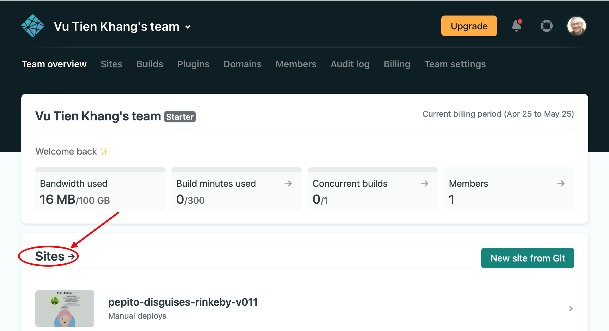
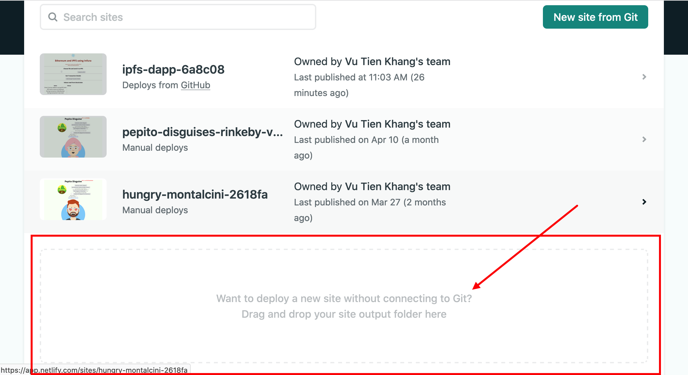
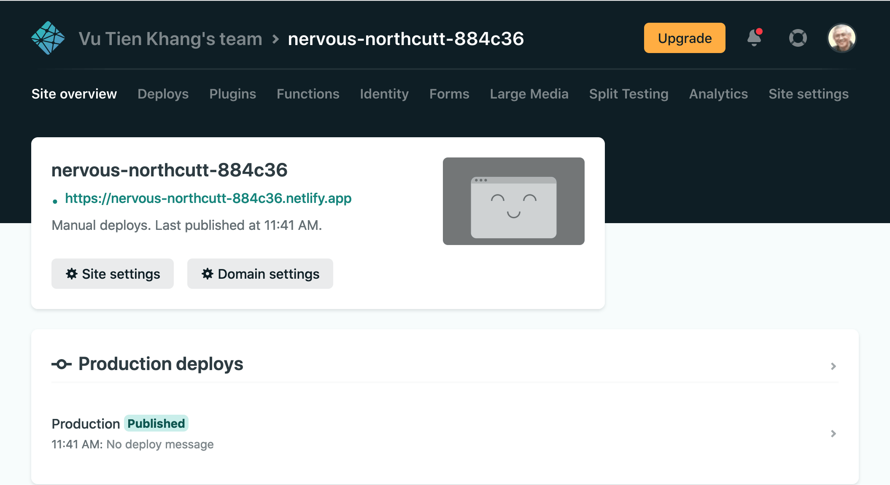

# Tutorial Full Stack "_hello World_" IPFS + blockchain - Part 4: deploy in production
## Why this tutorial?
This 4-part tutorial is a kind of "_Hello World_" that covers a Full Stack blockchain and IPFS workflow, including deployment in production. After you have completed it, you'd have deployed a blockchain smart contract on a public testnet, stored a file on IPFS using a web app that is publicly hosted. It is more ambitious than the usual tutorials that end up with a demo that only stays on your local computer. Here we go one step further, in production.

1. In [Part 1](./TUTO-1.md) we've coded our smart contract and deployed it in production on the Ropsten test net.
2. In [Part 2](./TUTO-2.md) we'll use the existing libraries and tools to scaffold a boilerplate React webapp and have it executing.
3. In [Part 3](./TUTO-3.md) we'll add our actual code and run it locally.
4. In this part we'll deploy the frontend in production.

If you are relatively new to blockchain, the jargon is explained [here](./TUTO-5.md).

**Hint**: When you execute actions guided by this tutorial, if you need help on an error message, copy-paste the message on a search engine followed by `stack exchange`. Many other people have met the same issue before you and many answers have been given on the Internet.

> _This tutorial will contain explanations that are not directly related to the coding task. These explanations will be highlighted as "Insider Notes". You can skip reading them without damage to the coding._

## Deployment in production
### Sign up to Netlify free tier
The blockchain backend is already deployed in production on Ropsten. To deploy the frontend in production, we use Netlify. Later on, we'll use Fleek to deploy also on IPFS: this would make your dApp totally future-proof.
* Open in your browser the Netlify homepage and sign up for a free account: https://www.netlify.com/
* Once we're signed up, a screen will be displayed to add a site from github. 

### Manual build the frontend
Don't do anything yet on this screen. If you know well `git` and `github`, this is the best choice. But for this tutorial we assume that you don't know yet `git` and `github`, so we'll deploy by drag-and-drop. For this, in your console, and in the project root folder `ipfs-dapp`, run the following command to "build" the complete standalone dApp:
```shell
$ npm run build

```
This will create in your folder `ipfs-dapp` a new child folder named `build` that has our entire frontend, as standalone and ready to be dragged and dropped as-is in Netlify.
### Netlify site creation page
Back in Netlify, instead of clicking on the button "New site from Git", click rather on "Sites". Yes, it doesn't look like a button, but it is clickable.

### Drag and drop
It will open a drag-and-drop zone at the bottom of the screen. Drag and drop the whole folder `build` here.

### Production deployed
**Bang!** Your dApp is in production from a hosting service. The screen says "Manual deploys". Netlify displays a link you can click on to run your production web app. 


### Click on it and you'll see the same dApp screen as in Part 3


## What have we learned?
This concludes part 4 of the tutorial. 
1. You have registered for a free-tier user account on Netlify.
2. You know what is a second-level added value cloud service, the first level being AWS, Azure, Google Cloud etc. BTW, Infura is also such an added-value cloud service. This is the latest trend of the Internet.
3. You have deployed in production a Full Stack dApp that includes IPFS, blockchain, React.
   
## Variant: Commit on `git`
This section assumes some knowledge of `git` and `github`. It is not necessary for the core "Hello World". Feel free to skip it. The advantage when you have the code on `github` is that Netlify can do automatic build of your deployment everytime you push your changes to `github`'s `main` branch.

### Commit on `git` and `github`
To commit on the local `git`, type this series of commands:
```shell
$ git add -A
$ git commit -m "initialise dApp from React boilerplate"
```
On `github`, create a repository and link it to the folder `ipfs-dapp`. Github will propose you to run the following commands to push the local git to the github repository.
```shell
$ git remote add origin https://github.com/kvutien/ipfs-dapp.git
$ git branch -M main
$ git push -u origin main
```
### Link your repository to Netlify
Skip the build step above. Netlify will do it automatically for you.

In Netlify screen, instead of clicking on "Sites", click on the button "New Site on Git". 
* Netlify opens your Github login page 
* Authorize Netlify to access your Github account in read-only
* Choose the repository of our frontend
* Netlify will detect that it is a React application and propose the deployment parameters
* Accept all
* Wait for the build to be done by Netlify, and observe that the production site is deployed.